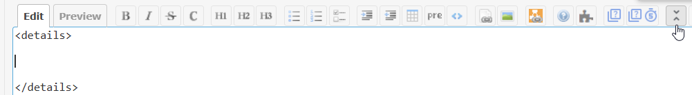
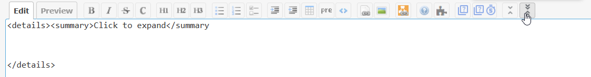
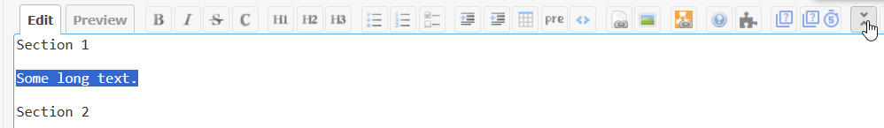
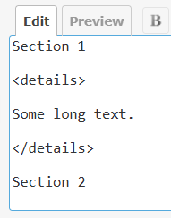
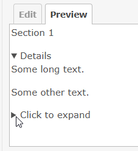
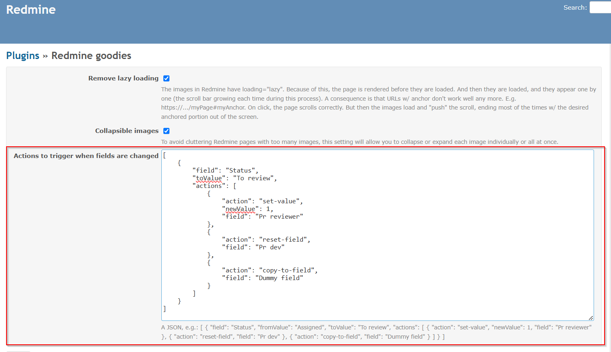
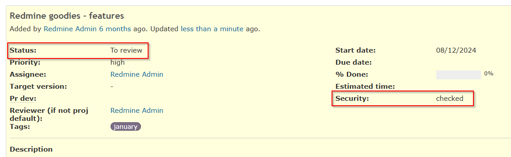
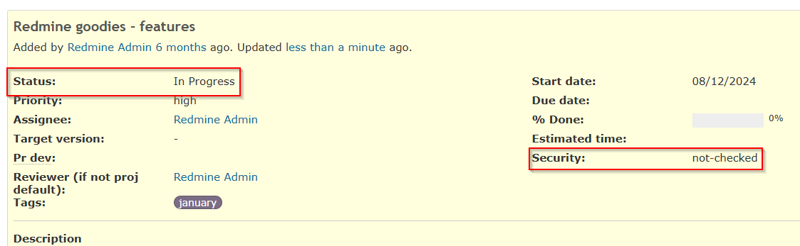

# redmine_goodies

# Features

## Button for `
` tag

Simple version:

Version w/ custom text for expand/collapse:

You can select an existing section, and it will be wrapped in `
`.

And by the way, this is how it's rendered. `
` is a standard HTML tag; it's not our invention. You can use it anywhere in HTML and/or Markdown. In other programs as well, e.g. GitHub, etc. We use this tag even for this `README.md` that you are currently reading 🙂.

## Button and highlight for questions/answers

### Add questions

<table>
    <tr>
        <td>Fig 1</td>
        <td>Fig 2</td>
    </tr>
    <tr>
        <td>

        </td>
        <td>

        </td>
    </tr>
    <tr>
        <td colspan="2">Fig 3</td>
    </tr>
    <tr>
        <td colspan="2">

Questions w/o answer are in *yellow*.
        </td>
    </tr>
</table>

In our company we leverage this plugin and:
* we have a scheduled task (written in TS / [deno](https://deno.com/))
* that uses the API to check if the questions are answered
* and if not, it sends reminders.

### Answer to questions

<table>
    <tr>
        <td>Fig 1</td>
        <td>Fig 2</td>
    </tr>
    <tr>
        <td>

        </td>
        <td>

Will switch the issue in edit mode and add the macro.
        </td>
    </tr>
    <tr>
        <td colspan="2">Fig 3</td>
    </tr>
    <tr>
        <td colspan="2">

If the issue is in edit mode, it will append the macro, to the existing note (at cursor position)
        </td>
    </tr>
    <tr>
        <td colspan="2">Fig 4</td>
    </tr>
    <tr>
        <td colspan="2">

The answers are in *green*. The answered questions switched from *yellow* to *blue*. 

Questions and answers are cross linked; click on *#note-???* to navigate between them.
        </td>
    </tr>
    <tr>
        <td colspan="2">Fig 5</td>
    </tr>
    <tr>
        <td colspan="2">

A question can have multiple answers.
        </td>
    </tr>    
</table>

## Actions to trigger when fields are changed

In the plugin's settings, you can set the **actions** using a JSON, such as:

Before status changes:

WHEN field **Status** is changed from **To review** to another value, THEN the field **Security** will be reset to its default value:

Available list of triggers: ["when-changed-from"]  
Available list of actions: ["reset-field"]

*NOTE:* More triggers and actions will be added in the future, so stay tuned.

# Licenses for third party components/assets

We use some icons from [Google Fonts](https://fonts.google.com/icons), licensed under [Apache License v2](https://www.apache.org/licenses/LICENSE-2.0.html)