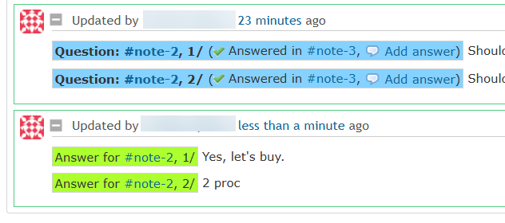

# redmine_goodies

# Features

## The "questions" system

### Add questions

<table>
    <tr>
        <td>Fig 1</td>
        <td>Fig 2</td>
    </tr>
    <tr>
        <td>

        </td>
        <td>

        </td>
    </tr>
    <tr>
        <td colspan="2">Fig 3</td>
    </tr>
    <tr>
        <td colspan="2">

Questions w/o answer are in *yellow*.
        </td>
    </tr>
</table>

In our company we leverage this plugin and:
* we have a scheduled task (written in TS / [deno](https://deno.com/))
* that uses the API to check if the questions are answered
* and if not, it sends reminders.

### Answer to questions

<table>
    <tr>
        <td>Fig 1</td>
        <td>Fig 2</td>
    </tr>
    <tr>
        <td>

        </td>
        <td>

Will switch the issue in edit mode and add the macro.
        </td>
    </tr>
    <tr>
        <td colspan="2">Fig 3</td>
    </tr>
    <tr>
        <td colspan="2">

If the issue is in edit mode, it will append the macro, to the existing note (at cursor position)
        </td>
    </tr>
    <tr>
        <td colspan="2">Fig 4</td>
    </tr>
    <tr>
        <td colspan="2">

The answers are in *green*. The answered questions switched from *yellow* to *blue*. 

Questions and answers are cross linked; click on *#note-???* to navigate between them.
        </td>
    </tr>
    <tr>
        <td colspan="2">Fig 5</td>
    </tr>
    <tr>
        <td colspan="2">

A question can have multiple answers.
        </td>
    </tr>    
</table>

# Licenses for third party components/assets

We use some icons from [Google Fonts](https://fonts.google.com/icons), licensed under [Apache License v2](https://www.apache.org/licenses/LICENSE-2.0.html)