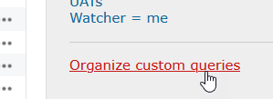
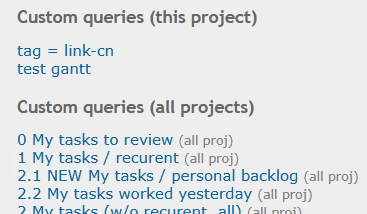
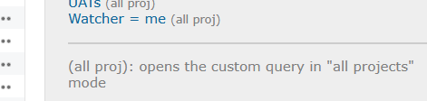

# Featurebook > OrganizeCustomQueriesTad.md
Go to [Featurebook > Index](FEATUREBOOK.md)

## TOC

* [`@Scenario` `_quickInstructions()`](#_quickInstructions)

## Scenarios

<table>
<tr><td> 

`@Scenario` `_quickInstructions()` 
</td></tr>
<tr><td>

Custom queries (in the right-hand bar) are grouped in `My custom queries` and `Custom queries`.

This feature:

splits `Custom queries` into `Custom queries (this project)` and `Custom queries (all projects)`, using the same styling for the titles/"separators":

Each CQ (all projects) has a link to open that CQ in "all projects mode".

After the last CQ, there is a `
` and then the helper text.

</td></tr>
</table>
