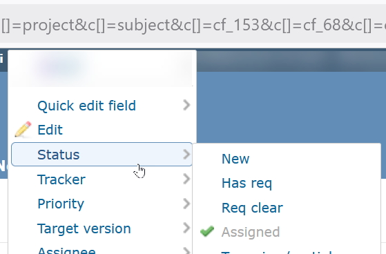
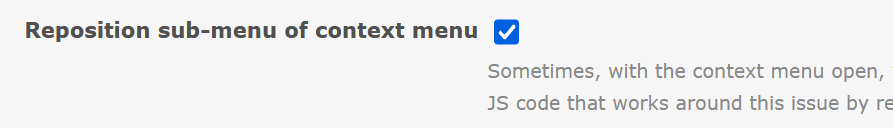
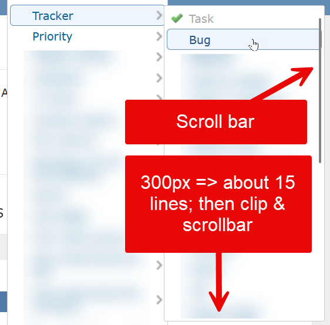
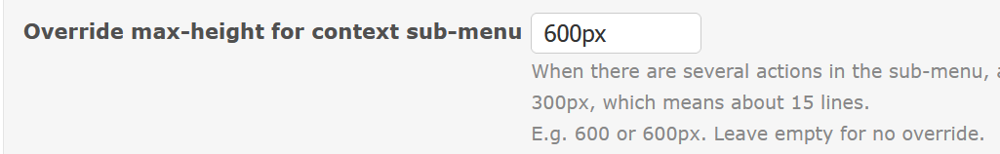

# Featurebook > QualityOfLifeTad.md
Go to [Featurebook > Index](FEATUREBOOK.md)

## TOC

* [`@Scenario` `feature_repositionSubmenuOfContextMenu()`](#feature_repositionSubmenuOfContextMenu)
* [`@Scenario` `feature_overrideMaxHeightOfSubmenu()`](#feature_overrideMaxHeightOfSubmenu)

## Scenarios

<table>
<tr><td> 

`@Scenario` `feature_repositionSubmenuOfContextMenu()` 
</td></tr>
<tr><td>

Sometimes, with the context menu open, when opening a sub-menu: the "child" sub menu is too high and exits the screen. Hence we have some JS code that works around this issue by repositioning the popup.

Before:

After:

Settings:

</td></tr>
</table>

<table>
<tr><td> 

`@Scenario` `feature_overrideMaxHeightOfSubmenu()` 
</td></tr>
<tr><td>

When there are several actions in the sub-menu, at some point the max-height is reached and a scroll bar appears. The Redmine default is about 300px, which means about 15 lines.

Although general, this was meant for `Quick edit field`. This is something that needs to be "quick". And if there are quite a few fields, some on 2 lines => a scroll bar may appear. Which would make the "quick" ... less quick 🙂.

Settings:

</td></tr>
</table>
