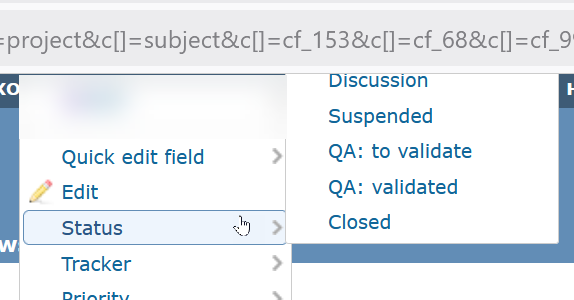
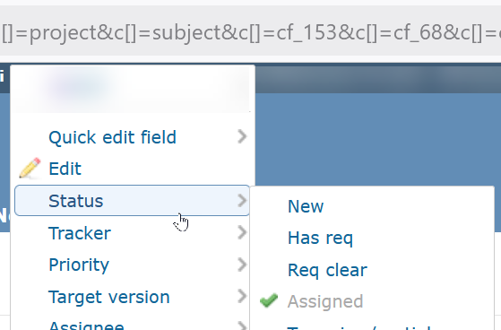
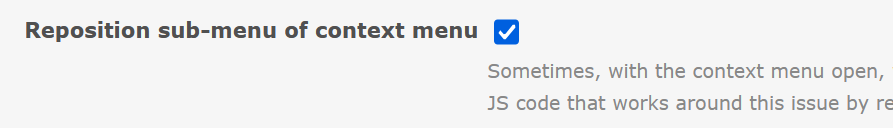
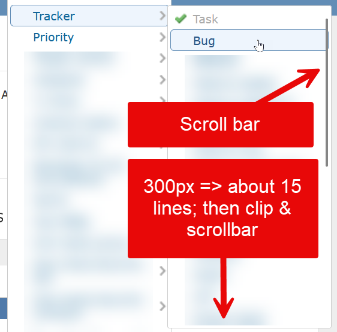
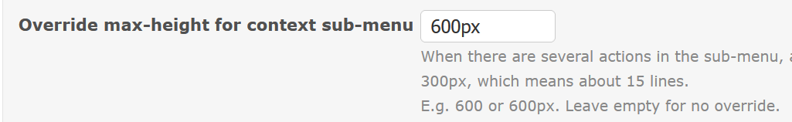
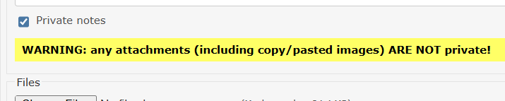

# Featurebook > QualityOfLifeTad.md
Go to [Featurebook > Index](FEATUREBOOK.md)

## TOC

* [`@Scenario` `feature_repositionSubmenuOfContextMenu()`](#feature_repositionSubmenuOfContextMenu)
* [`@Scenario` `feature_overrideMaxHeightOfSubmenu()`](#feature_overrideMaxHeightOfSubmenu)
* [`@Scenario` `feature_defaultValuesForSettings()`](#feature_defaultValuesForSettings)
* [`@Scenario` `feature_warningPrivateNotes()`](#feature_warningPrivateNotes)

## Scenarios

<table>
<tr><td> 

`@Scenario` `feature_repositionSubmenuOfContextMenu()` 
</td></tr>
<tr><td>

Sometimes, with the context menu open, when opening a sub-menu: the "child" sub menu is too high and exits the screen. Hence we have some JS code that works around this issue by repositioning the popup.

Before:

After:

Settings:

</td></tr>
</table>

<table>
<tr><td> 

`@Scenario` `feature_overrideMaxHeightOfSubmenu()` 
</td></tr>
<tr><td>

When there are several actions in the sub-menu, at some point the max-height is reached and a scroll bar appears. The Redmine default is about 300px, which means about 15 lines.

Although general, this was meant for `Quick edit field`. This is something that needs to be "quick". And if there are quite a few fields, some on 2 lines => a scroll bar may appear. Which would make the "quick" ... less quick 🙂.

Settings:

</td></tr>
</table>

<table>
<tr><td> 

`@Scenario` `feature_defaultValuesForSettings()` 
</td></tr>
<tr><td>

The defaults work like this: if no settings in DB OR settings exists in DB but no explicit value for a particular setting =>
the default is applied. 

This is for the use case: an user has already our plugin. He/she updates to a new version of plugin => defaults are applied
automatically.
</td></tr>
</table>

<table>
<tr><td> 

`@Scenario` `feature_warningPrivateNotes()` 
</td></tr>
<tr><td>

When adding a private note, it's not obvious at all that pasted images ARE NOT private. Hence we are adding a warning message about this.

Let's display this message: `WARNING: any attachments (including copy/pasted images) ARE NOT private!`. Highlighted in yellow. Appears only when `Private` checkbox
is checked.

</td></tr>
</table>
