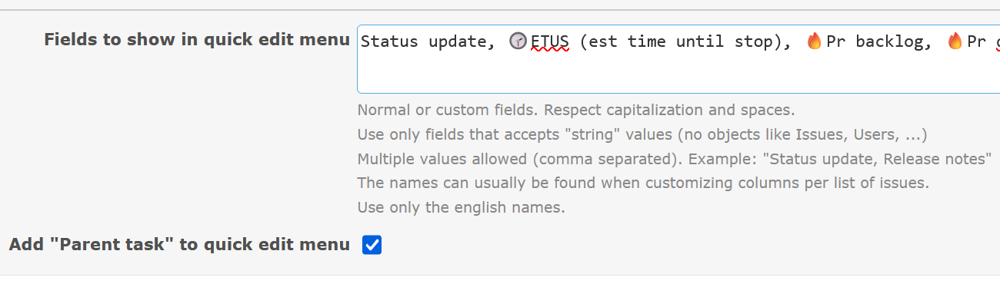

# Featurebook > QuickEditFieldTad.md
Go to [Featurebook > Index](FEATUREBOOK.md)

## TOC

* [`@Scenario` `_quickInstructions()`](#_quickInstructions)

## Scenarios

<table>
<tr><td> 

`@Scenario` `_quickInstructions()` 
</td></tr>
<tr><td>

Redmine offers quick field edit only for fields of type many-to-one (e.g. `Status`, `Tracker`, etc.). This
feature extends the quick edit flow to "normal" fields.

The context menu (right click) of an issue has this:

And then:

In the plugin configuration screen:

</td></tr>
</table>
