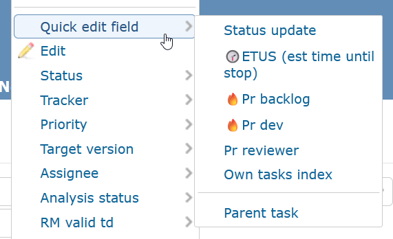
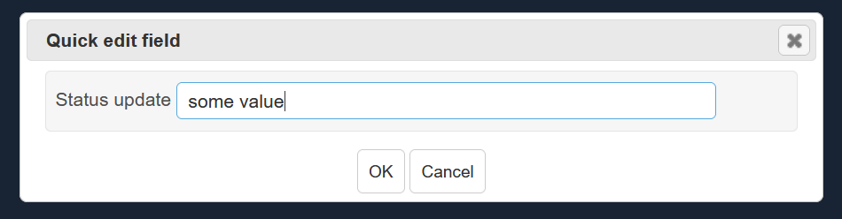
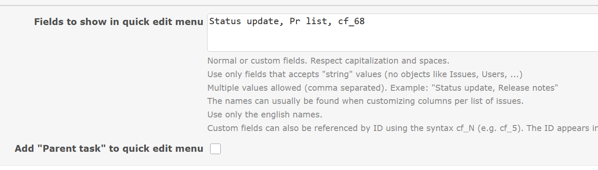
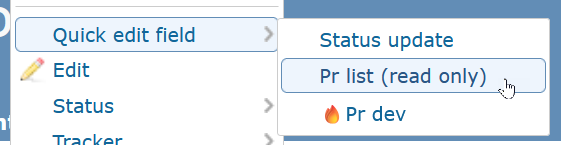

# Featurebook > QuickEditFieldTad.md
Go to [Featurebook > Index](FEATUREBOOK.md)

## TOC

* [`@Scenario` `_quickInstructions()`](#_quickInstructions)
* [`@Scenario` `feature_settings()`](#feature_settings)
* [`@Scenario` `feature_permissions()`](#feature_permissions)

## Scenarios

<table>
<tr><td> 

`@Scenario` `_quickInstructions()` 
</td></tr>
<tr><td>

Redmine offers quick field edit only for fields of type many-to-one (e.g. `Status`, `Tracker`, etc.). This
feature extends the quick edit flow to "normal" fields.

The context menu (right click) of an issue has this:

And then:

</td></tr>
</table>

<table>
<tr><td> 

`@Scenario` `feature_settings()` 
</td></tr>
<tr><td>

In the plugin configuration screen:

</td></tr>
</table>

<table>
<tr><td> 

`@Scenario` `feature_permissions()` 
</td></tr>
<tr><td>

In order to access the feature, the "edit issue" permission needs to be present.
And the field needs to be "read/write". E.g. if read only:

</td></tr>
</table>
