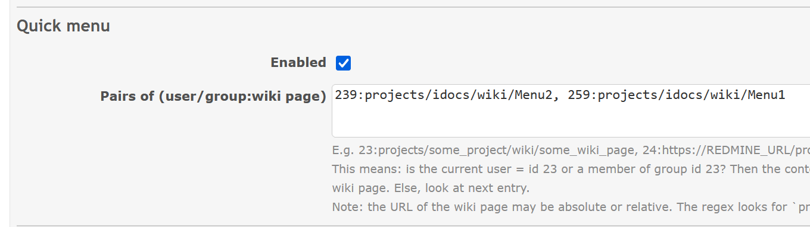
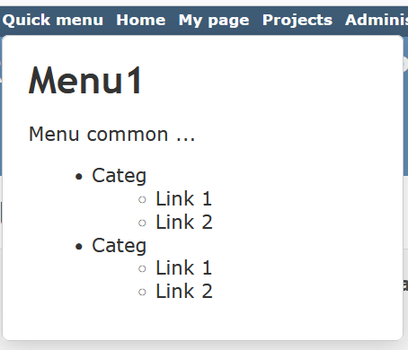

# Featurebook > QuickMenuTad.md
Go to [Featurebook > Index](FEATUREBOOK.md)

## TOC

* [`@Scenario` `feature_settings()`](#feature_settings)
* [`@Scenario` `feature_main()`](#feature_main)

## Scenarios

<a id="feature_settings"></a>
<table>
<tr><td> 

`@Scenario` `feature_settings()`<br />
</td></tr>
<tr><td>

The settings area for this feature has the following.

<details><summary>Impl details for AI</summary>

Checkbox w/ label: `Enabled`.

Input w/ label: `Pairs of (user/group: wiki page)`.

Lines for description: 

```text
E.g. 23:projects/some_project/wiki/some_wiki_page, 24:https://REDMINE_URL/projects/some_project/wiki/some_other_wiki_page

This means: is the current user = id 23 or a member of group id 23? Then the content rendered in the "My quick menu" popup is taken from that wiki page. Else, look at next entry.

Note: the URL of the wiki page may be absolute or relative. The regex looks for `projects/.../wiki/...`.
```
</details>


</td></tr>
</table>

<a id="feature_main"></a>
<table>
<tr><td> 

`@Scenario` `feature_main()`<br />
</td></tr>
<tr><td>

If enabled, we add in the main menu (normal and mobile mode) a link `Quick menu`. Before home.

On click, a popup. Some logic is ran to see if there is some content (and what content) cf. Settings. If nothing found => some friendly message. Otherwise => that content.

This is intended mainly for a multi level list w/ links. A menu practically. If the width is reasonably chosen, it may work for both normal and mobile. On click outside => Close the popup.

HINT: multiple menus for different populations are possible. If different menus share common content, use the `include` macro.


</td></tr>
</table>
