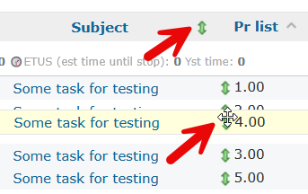
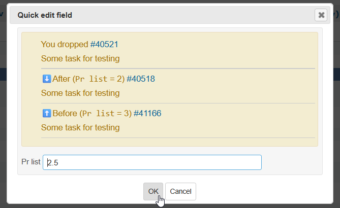
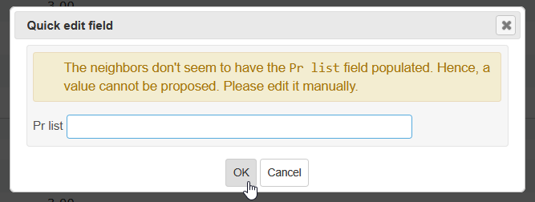
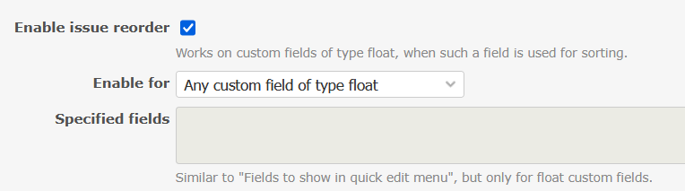
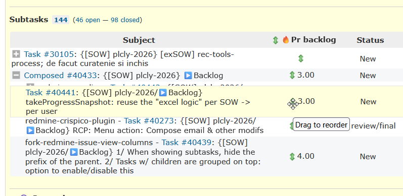
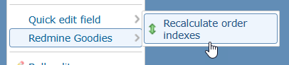
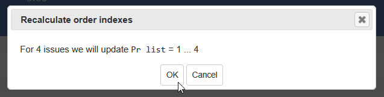
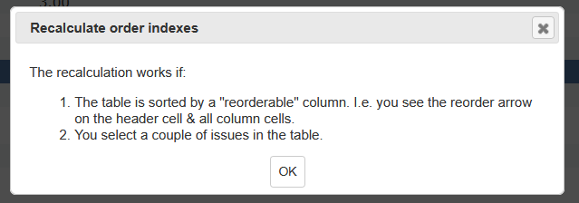

# Featurebook > ReorderTad.md
Go to [Featurebook > Index](FEATUREBOOK.md)

## TOC

* [`@Scenario` `_quickInstructions()`](#_quickInstructions)
* [`@Scenario` `feature_iconInHeaderCell()`](#feature_iconInHeaderCell)
* [`@Scenario` `feature_settings()`](#feature_settings)
* [`@Scenario` `feature_forceEnablementForFields()`](#feature_forceEnablementForFields)
* [`@Scenario` `feature_permissions()`](#feature_permissions)
* [`@Scenario` `feature_recalculateOrderIndexes1()`](#feature_recalculateOrderIndexes1)
* [`@Scenario` `feature_recalculateOrderIndexes2()`](#feature_recalculateOrderIndexes2)

## Scenarios

<table>
<tr><td> 

`@Scenario` `_quickInstructions()` 
</td></tr>
<tr><td>

Managing "lists" in Redmine has been requested by a lot of people. Our approach to this was:

* v1: create a custom field of type float. Have a custom query sorted by that CF.
* v2: using the `Quick edit field` feature, we had a user friendlier flow to reorder. Not perfect, but better.
* v3: i.e. **this feature**: reuse the "reorder rows in table" mechanism from the Custom fields table like this:

Drag a row at the desired location:

On drop: propose a new value for that CF:

* If dropped between 2 rows that have values for that CF => propose a value "in the middle". E.g. 2 ~ 3 => 2.5.
* If dropped at the beginning or end => propose e.g. for 2 or 2.5 => 1 or 3.
* The proposed value can be manually corrected. In some cases it should be.

</td></tr>
</table>

<table>
<tr><td> 

`@Scenario` `feature_iconInHeaderCell()` 
</td></tr>
<tr><td>

There is a green marker on eligible header cells. Nothing happens when clicking on it. 
The marker is visible regardless of the sort state. If indicates to the user that the reorder feature is possible on that column.
</td></tr>
</table>

<table>
<tr><td> 

`@Scenario` `feature_settings()` 
</td></tr>
<tr><td>

The `Reorder` sections is settings has:
1/ `Enable issue reorder` checkbox (by default enabled): Enable issue reorder. 
Explanation: Works on custom fields of type float, when such a field is used for sorting.
2/ `Enable for` drop down w/ possible values:
* a/ `Any custom field of type float` (default)
* b/ `White list: only the specified fields`
* c/ `Black list: all except the specified fields`

If b/ or c/ selected, then the following input `Specified fields` is enabled. 
Explanation: Similar to "Fields to show in quick edit menu". But only custom fields of type float.

</td></tr>
</table>

<table>
<tr><td> 

`@Scenario` `feature_forceEnablementForFields()` 
</td></tr>
<tr><td>

The "reorder" feature activates by looking at the header cell of the column: is the CF of type float? Is the column sorted by this column? 

For the fields "forced", these conditions are not checked, and the feature is forced.

Reason? E.g. if using a plugin such as `redmine_issue_view_columns` to display the sub-issues (of an issue) as table.

</td></tr>
</table>

<table>
<tr><td> 

`@Scenario` `feature_permissions()` 
</td></tr>
<tr><td>

The "Quick edit field" logic already takes into account permissions. The user needs to have "edit issue" permission. And the custom field needs to be read/write (via workflow).

The same mechanism is reused. If no permissions => no icons (header cell, or table cells).
</td></tr>
</table>

<table>
<tr><td> 

`@Scenario` `feature_recalculateOrderIndexes1()` 
</td></tr>
<tr><td>

After some reorder operations, the indexes may be odd looking. E.g. -1, 0, 3, 4.25, 6.We may want to normalize the order: 1, 2, ...

There is a context menu action: `Redmine Goodies > Recalculate order indexes`. On click, there is always a popup.

* GIVEN1 the table is sorted by a "reorder eligible" field
  * i.e. the header cell and row cells have the reorder icon
* GIVEN2 several (more than 1) rows are selected
* WHEN1 click the context menu action
* THEN1 the popup displays a recap of what there will be done
  * e.g. For 12 issues we'll update `Pr list` = 1 .. 12
* WHEN2 click on OK
* THEN2 the selected issues will be updated cf. message

</td></tr>
</table>

<table>
<tr><td> 

`@Scenario` `feature_recalculateOrderIndexes2()` 
</td></tr>
<tr><td>

* GIVEN at least one condition is not met (cf. previous scenario)
* WHEN click the context menu action
* THEN an explanatory message is displayed
  * The recalculation works if: 
  * 1/ the table is sorted by a "reorderable" column. I.e. you see the reorder arrow on the header cell & all column cells
  * 2/ you select a couple of issues in the table

</td></tr>
</table>
